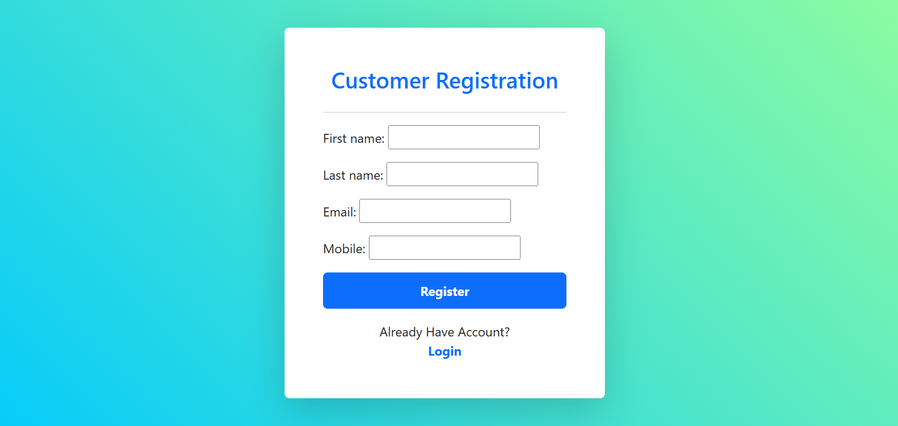
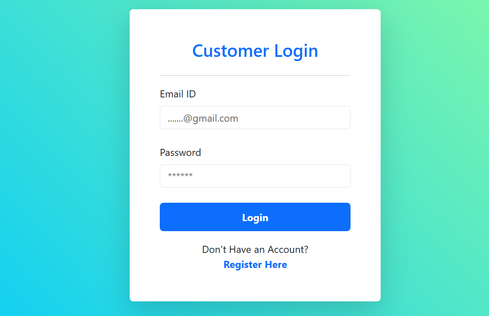
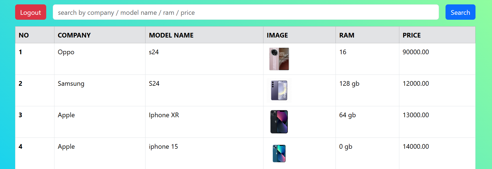
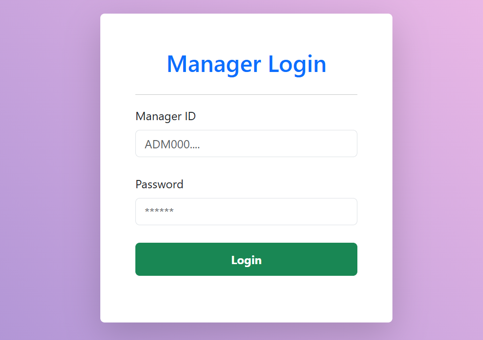
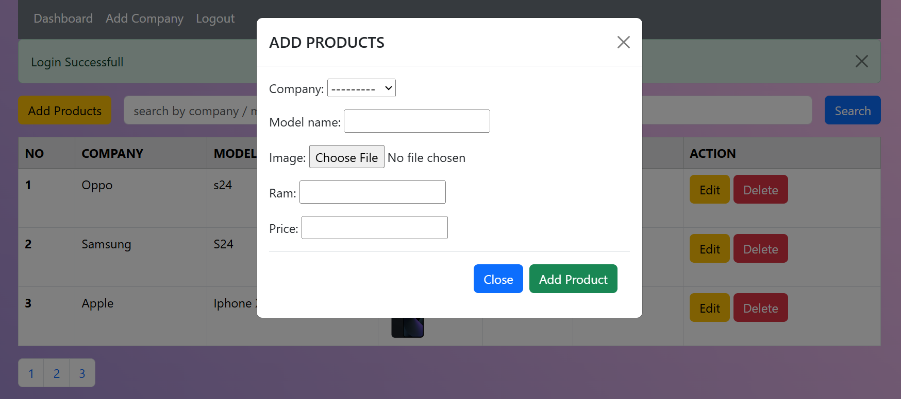
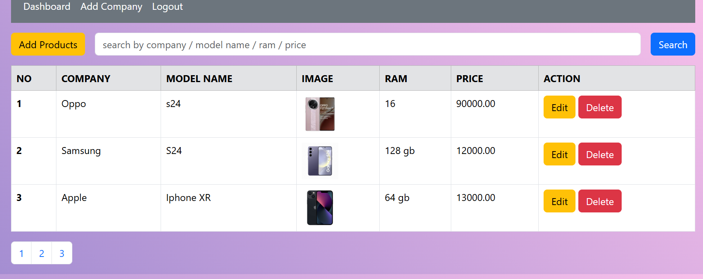
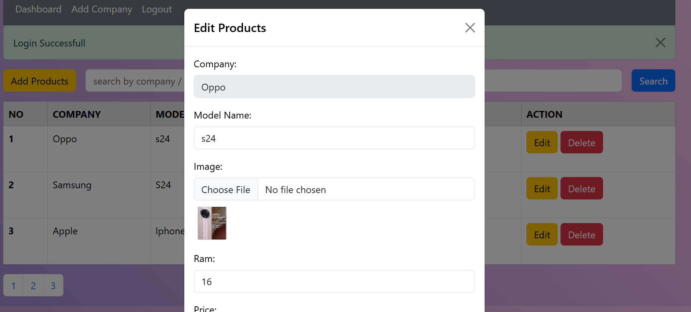
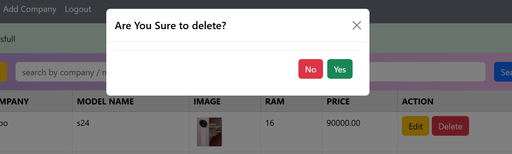

# product-management-system

    This project is a product management system where only managers can perfom CRUD operations and users can search products. 
    
    Without logging in, users will not be able to enter or interact with the server.

    Features:

> Registration: New users can register an account to use the application.

> Login: Registered users can log in to access the app.(manager registration is not it is managed by admin only)

> CRUD Operations:

> Pagination

> I use Django Model Form for CRUD operation

# For User : 

    This is registration / login Page: User registration is unique

 

    after registration done user can login :  mobile number is password 

# For Managers :

    Manager registration is only done in admin pannel : admin provide login credential to manager after that he can login 

> Add Products

> Read Products with search and also pagination

> Edit Products

> Delete Product with check 
